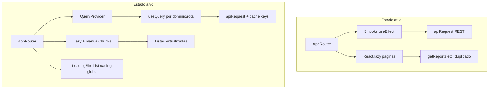

# Implementation Plan: Melhorar Performance do MediConnect

**Branch**: `001-app-performance` | **Date**: 2026-05-26 | **Spec**: [spec.md](./spec.md)

**Input**: Feature specification from `/specs/001-app-performance/spec.md`

**Stack (user)**: Vite, React, TypeScript, Supabase, API

## Summary

Melhorar a experiência percebida de performance do MediConnect (área da clínica e portal do paciente) atingindo metas da spec: navegação entre módulos ≤ 2 s (P95), tela inicial pós-login ≤ 4 s (P90), buscas em listas ≤ 1 s, feedback visual ≤ 300 ms, sem regressão funcional.

**Abordagem técnica**: manter Vite + React 18 + TypeScript + Supabase REST (`src/services/api.ts`), introduzir camada de cache/deduplicação (TanStack Query), carregamento sob demanda por rota/perfil, queries paginadas e colunas mínimas no PostgREST, virtualização de listas longas, code-splitting de vendors pesados (FullCalendar, BlockNote), estados de carregamento unificados e linha de base mensurável antes/depois.

## Technical Context

**Language/Version**: TypeScript ~5.9, React 18.3, ES modules

**Primary Dependencies**: Vite 7, `@vitejs/plugin-react`, Supabase via REST (`fetch` em `api.ts`), Mantine/FullCalendar/BlockNote (chunks lazy por rota)

**Storage**: Supabase PostgreSQL (PostgREST `/rest/v1/*`), Storage para fotos de pacientes

**Testing**: Sem suite hoje — adicionar Vitest + scripts `test`/`test:perf` para hooks e utilitários; Lighthouse/manual para métricas de UX (ver [quickstart.md](./quickstart.md))

**Target Platform**: SPA no navegador (desktop/tablet primário)

**Project Type**: Web application (frontend único em `src/`)

**Performance Goals** (from spec):

| ID | Meta |
|----|------|
| SC-001 | 95% transições entre módulos interativas ≤ 2 s |
| SC-002 | 90% primeiros acessos pós-login interativos ≤ 4 s |
| SC-003 | Busca pacientes ≤ 1 s após debounce (até 500 ativos) |
| SC-005 | −40% tempo fluxo login → agenda → busca → perfil vs baseline |
| SC-006 | Feedback visual ≤ 500 ms; sem branco > 3 s em rede lenta |

**Constraints**: Zero remoção de funcionalidades (FR-008); RLS Supabase inalterado; UX em português; acessibilidade mantida; sem migração obrigatória para `@supabase/supabase-js` nesta feature

**Scale/Scope**: Clínicas pequeno/médio (~500 pacientes, ~30 usuários simultâneos); 12+ páginas lazy; 5 hooks globais atuais em `AppRouter`

## Constitution Check

*GATE: Must pass before Phase 0 research. Re-check after Phase 1 design.*

Reference: `.specify/memory/constitution.md` v1.0.0

| Princípio | Gate | Status |
|-----------|------|--------|
| I. TypeScript Estrito | `tsc -b` sem erros; sem `any` não justificado | ✅ PASS |
| II. Supabase RLS | Queries autenticadas; sem bypass no cliente; índices/migrations opcionais respeitam RLS | ✅ PASS |
| III. UX em Português | Loaders/erros/toasts em PT-BR; `aria-busy` nos loaders | ✅ PASS |
| IV. Performance Percebida | Metas SC-001–006; feedback 300 ms; tiered loading | ✅ PASS (feature core) |
| V. Erros de API Claros | Contratos ui-loading + ApiError em api.ts | ✅ PASS (design) |

**Post-design re-check**: PASS — TanStack Query e virtualização justificados em Complexity Tracking; sem violações não documentadas.

## Project Structure

### Documentation (this feature)

```text
specs/001-app-performance/
├── plan.md              # This file
├── research.md          # Phase 0 decisions
├── data-model.md        # Performance domain model
├── quickstart.md        # Baseline & validation
├── contracts/           # UI + data contracts
└── tasks.md             # (/speckit-tasks — not created here)
```

### Source Code (repository root)

```text
src/
├── AppRouter.tsx           # Orquestração: reduzir eager load; Suspense + loading shell
├── pages/
│   ├── lazyPages.tsx       # Route code splitting (existente)
│   ├── Dashboard/
│   ├── Patients/
│   ├── Appointments/
│   ├── Messages/
│   ├── Financial/
│   └── PatientPortal/
├── components/ui/
│   └── PageLoader/         # Feedback global (existente; estender padrão)
├── hooks/
│   ├── usePatients.ts      # Migrar para query layer
│   ├── useAppointments.ts
│   ├── useMedicalData.ts
│   ├── useFinancial.ts
│   ├── useStaff.ts
│   └── query/              # NEW: QueryClient provider, keys, hooks finos
├── services/
│   ├── api.ts              # REST Supabase
│   ├── patients.ts         # Paginação + select mínimo
│   ├── appointments.ts     # Filtros por período/doctor
│   ├── domain.ts           # getReports deduplicado
│   └── financial.ts
├── contexts/
│   └── QueryProvider.tsx   # NEW (opcional nome)
supabase/
└── migrations/             # Índices opcionais se análise de slow queries exigir
vite.config.ts              # manualChunks
```

**Structure Decision**: Monorepo frontend único; backend = Supabase PostgREST + Edge Functions existentes. Performance é cross-cutting em `AppRouter`, `hooks/`, `services/` e páginas com listas.

## Architecture Overview



### Phase mapping (implementation — for `/speckit-tasks`)

| Phase | Focus | Spec stories |
|-------|--------|--------------|
| 0 | Baseline + métricas | SC-005, SC-001–003 |
| 1 | Query cache + dedupe pacientes/reports | P1, P3 |
| 2 | Route-scoped data + shell loading | P1, P3 |
| 3 | Paginação + virtualização listas | P2 |
| 4 | Bundle split + prefetch módulos frequentes | P1, P3 |
| 5 | Rede lenta: timeout/retry UX | P4 |
| 6 | Validação SC-001–007 + regressão | All |

## Key Design Decisions

See [research.md](./research.md) for full rationale.

1. **TanStack Query v5** — cache, dedupe, `staleTime`, `enabled` por rota; substitui padrão useState/useEffect nos hooks de domínio.
2. **Carregamento por rota** — pacientes/agenda críticos no login; financial/staff/medical só quando `pageId` ou permissão exigir.
3. **Queries REST enxutas** — `select` colunas necessárias; `limit`/`offset` ou filtro por data em appointments/messages; índices DB se P95 REST > 400 ms.
4. **`@tanstack/react-virtual`** — listas Patients/Team/Financial/Messages.
5. **Vite `manualChunks`** — `fullcalendar`, `blocknote`, `mantine`.
6. **Loading contract** — `PageLoader` se chunk > 300 ms; skeleton por página se dados > 300 ms; erros com retry (FR-009).

## Complexity Tracking

| Addition | Why Needed | Simpler Alternative Rejected Because |
|----------|------------|--------------------------------------|
| TanStack Query | 5+ fetches duplicados de `patients` no boot; Dashboard+Reports chamam `getReports` separado | Context manual com Map exige invalidação custom em cada mutation |
| react-virtual | SC-003/FR-006 com 500+ linhas DOM | Paginação sozinha não resolve scroll de agenda/calendário |
| manualChunks | Chunks de agenda/relatórios puxam MB de libs | Apenas lazy route já existe; vendors ainda inflam primeiro paint do módulo |

## Risks & Mitigations

| Risk | Mitigation |
|------|------------|
| Regressão em mutations (CRUD) | `queryClient.invalidateQueries` padronizado por entidade |
| Stale data entre usuários da clínica | `staleTime` curto (30–60 s) + refetch on window focus para agenda/mensagens |
| Portal paciente com menos dados | `usePatientAIData` já escopado; alinhar keys de query |
| Sem testes automatizados hoje | Vitest mínimo + checklist manual quickstart antes de merge |

## Generated Artifacts

| Artifact | Path |
|----------|------|
| Research | [research.md](./research.md) |
| Data model | [data-model.md](./data-model.md) |
| Quickstart | [quickstart.md](./quickstart.md) |
| Contracts | [contracts/](./contracts/) |

## Next Step

Run **`/speckit-tasks`** to generate dependency-ordered `tasks.md`, then **`/speckit-implement`**.
